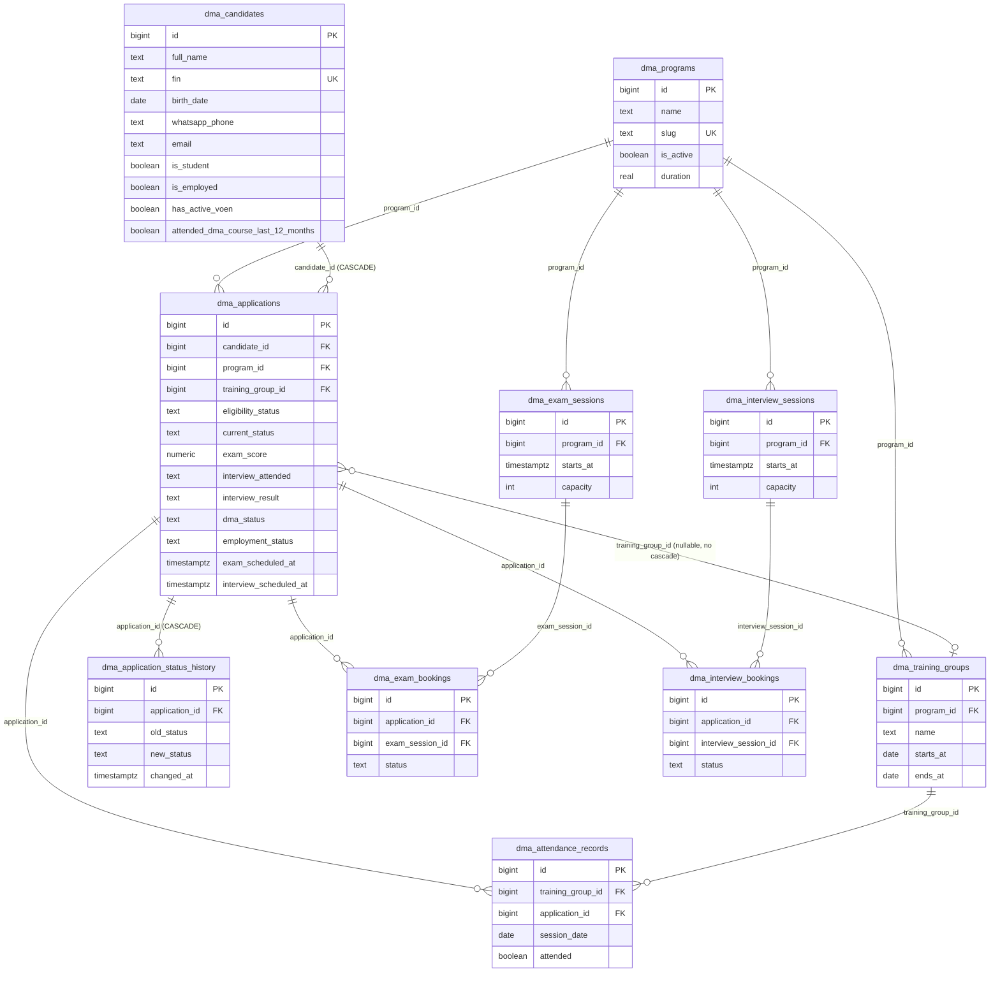

# INSTUDY ERP — Texniki və Funksional Audit

**Tarix:** 2026-09-28
**Hazırlayan:** Claude (Sonnet 5), read-only kod və sxem araşdırması
**Repo:** `instudy-automation` (branch `main`, commit `d7fcfe6`)
**Metod:** Bu audit CANLI Supabase bazasına birbaşa SQL sorğusu ilə DEYİL — (a) repo-dakı frontend kodunun (`admin/*.html`, `dma/*.html`, `api/dma/apply.js`) bütün `.from()/.select()/.insert()/.update()/.rpc()` çağırışlarının tam oxunması, və (b) `~/Downloads/instudy_dma_schema_bundle.sql` adlı, canlı bazadan (information_schema + pg_constraint + pg_trigger) çıxarılıb yenidən tərtib edilmiş 29 miqrasiyalıq sxem faylının oxunması yolu ilə hazırlanıb. Bu iki mənbə bir-birini tam təsdiqləyir (kodun istinad etdiyi hər sütun sxem faylında var, əksinə deyil). Bununla belə, **bu sessiyada canlı bazaya birbaşa sorğu göndərilməyib** — hər bölmədə bunun aydın işarəsi var.

**Etibarlılıq işarələri:**
- **VERIFIED (kod + sxem)** — kodun sorğuladığı və sxem faylında tam eyni şəkildə tərif olunan struktur.
- **VERIFIED (yalnız sxem)** — sxem faylında var, amma frontend kodunda heç bir istinad tapılmayıb (yəni UI-də istifadə olunmur).
- **NOT VERIFIED** — canlı baza sorğusu ilə təsdiqlənməyib (məsələn sətir sayları, real RLS policy-lərin bazada dəqiq bu cür olduğu).

---

## 0. Sistemin ümumi mənzərəsi — VACİB: eyni Supabase layihəsində İKİ ayrı sistem var

Bu Supabase layihəsi (eyni `SUPABASE_URL`) **iki tamamilə ayrı, bir-birinə bağlı olmayan sistemi** saxlayır:

| | **A) INSTUDY DMA ERP** (bu auditin mövzusu) | **B) Instagram DMA botu** (ayrı sistem, bu auditin əhatəsi xaricində) |
|---|---|---|
| Cədvəl prefiksi | `dma_*` (10 cədvəl) | `instagram_*`, `registrations`, `exam_slots`, `exam_bookings`, `ad_program_map` |
| Frontend | `admin/*.html`, `dma/apply`, `dma/exam`, `dma/interview` | `apply.html`, `exam.html` (istifadə olunmur), Instagram DM |
| Backend | `api/dma/apply.js` | `api/meta/webhook.js`, `lib/dma-flow.js`, `api/register.js`, `api/followups.js` |
| Qeydiyyat mənbəyi | `dma/apply/index.html` forması (canlı) | Google Form (canlı) + köhnə `apply.html` (istifadə olunmur) |
| Bu auditə aid? | **Bəli** | **Xeyr** — yalnız arxa planda mövcudluğu qeyd olunur, çünki eyni bazadadır və ad toqquşması riskini artıra bilər |

`instudy_dma_schema_bundle.sql`-in öz şərhi bunu təsdiqləyir (sətir 23-28): `dma_` prefiksi məhz bu iki sistemin ad toqquşmasının (məsələn "exam_bookings" adında artıq 5 sətirlik başqa bir cədvəl var idi) qarşısını almaq üçün seçilib.

**Bu audit yalnız (A) sisteminə aiddir.** (B) sistemi başqa bir sessiyada ətraflı sənədləşdirilib, burada təkrarlanmır.

---

## 1. Database Structure (Supabase) — `dma_*` cədvəlləri

Aşağıdakı 10 cədvəl mövcuddur. Hamısı `public` sxemasındadır, RLS aktivdir.

### 1.1 `dma_programs`

**Təyinat:** Təlim proqramlarının siyahısı (Backend, Frontend, HR, Data Analitika, Mühasibatlıq, Kompüter Operatoru və s.).

| Column | Type | Nullable | Default | PK/FK/Unique |
|---|---|---|---|---|
| id | bigint (identity) | NO | auto | **PK** |
| name | text | NO | — | |
| slug | text | NO | — | **UNIQUE** |
| is_active | boolean | YES | true | |
| created_at | timestamptz | YES | now() | |
| duration | real | YES | — | |

**Əlaqələr:** `dma_applications.program_id`, `dma_exam_sessions.program_id`, `dma_interview_sessions.program_id`, `dma_training_groups.program_id` bura FK ilə bağlıdır.
**Record sayı:** NOT VERIFIED (canlı sorğu tələb olunur).
**VACİB tapıntı:** Admin panelin 7 səhifəsində (`admin/*.html`) bu cədvələ **heç bir `.insert()` və ya `.update()` çağırışı tapılmadı** — yalnız `.select()`. Yəni **yeni proqram əlavə etmək və ya mövcudu redaktə etmək üçün ERP-də UI yoxdur**; bu, birbaşa Supabase Table Editor-dan və ya SQL ilə edilməlidir. (bax bölmə 2, "Proqram idarəetməsi" = Not implemented)

### 1.2 `dma_candidates`

**Təyinat:** Namizədin şəxsi məlumatları (bir FİN = bir namizəd, proqramlardan asılı olmayaraq).

| Column | Type | Nullable | Default | PK/FK/Unique |
|---|---|---|---|---|
| id | bigint (identity) | NO | auto | **PK** |
| full_name | text | NO | — | |
| fin | text | NO | — | **UNIQUE** |
| birth_date | date | NO | — | |
| email | text | YES | — | |
| whatsapp_phone | text | NO | — | |
| education | text | YES | — | |
| is_student | boolean | YES | — | |
| is_employed | boolean | YES | — | |
| has_active_voen | boolean | YES | — | |
| address | text | YES | — | |
| attended_dma_course_last_12_months | boolean | YES | — | |
| created_at | timestamptz | YES | now() | |
| updated_at | timestamptz | YES | now() | trigger ilə avtomatik (bax aşağı) |

**İndekslər:** `idx_candidates_fin`, `idx_candidates_full_name`, `idx_candidates_phone`.
**Trigger:** `set_candidates_updated_at` (BEFORE UPDATE) → `updated_at = now()`.
**Əlaqələr:** `dma_applications.candidate_id` → burada FK, **ON DELETE CASCADE** (namizəd silinsə, bütün müraciətləri də silinir).
**Record sayı:** NOT VERIFIED.
**Qeyd:** `fin` üzərində UNIQUE olduğu üçün **eyni FİN ikinci dəfə namizəd yarada bilmir** — bu, dublikatın qarşısını alan əsas mexanizmdir (bax bölmə 5).

### 1.3 `dma_applications`

**Təyinat:** Bir namizədin bir proqrama müraciəti. Sistemin **mərkəzi cədvəlidir** — demək olar bütün iş axını (pipeline) bu cədvəlin `current_status` sütunu üzərində qurulub.

| Column | Type | Nullable | Default | Constraint |
|---|---|---|---|---|
| id | bigint (identity) | NO | auto | **PK** |
| candidate_id | bigint | NO | — | **FK** → dma_candidates(id) ON DELETE CASCADE |
| program_id | bigint | NO | — | **FK** → dma_programs(id) |
| eligibility_status | text | YES | 'NEW' | CHECK in ('NEW','PRELIMINARILY_ELIGIBLE','MANUAL_REVIEW_REQUIRED','NOT_ELIGIBLE') |
| eligibility_reason | text | YES | — | trigger tərəfindən yazılır, əl ilə redaktə olunmur |
| unemployment_status | text | YES | 'NOT_CHECKED' | CHECK in ('NOT_CHECKED','PENDING','CONFIRMED','NOT_CONFIRMED') — **UI-də heç yerdə yazılmır (aşağı bax)** |
| current_status | text | YES | 'NEW_APPLICATION' | CHECK — 24 dəyər, tam siyahı bölmə 3-də |
| general_note | text | YES | — | |
| created_at | timestamptz | YES | now() | |
| updated_at | timestamptz | YES | now() | trigger ilə avtomatik |
| exam_score | numeric | YES | — | |
| interview_note | text | YES | — | |
| employment_status | text | YES | — | CHECK in ('SEEKING','EMPLOYED','NOT_SEEKING') |
| employment_note | text | YES | — | |
| employed_at | date | YES | — | |
| exam_scheduled_at | timestamptz | YES | — | |
| interview_scheduled_at | timestamptz | YES | — | |
| interview_attended | text | YES | — | CHECK in ('YES','NO') |
| interview_result | text | YES | — | CHECK in ('PASSED','FAILED','RESERVE') |
| dma_status | text | YES | — | CHECK in ('SUBMITTED','APPROVED','REJECTED') |
| training_group_id | bigint | YES | — | **FK** → dma_training_groups(id), CASCADE **YOX** (qəsdən — bax qeyd) |

**İndekslər:** `idx_applications_candidate`, `idx_applications_current_status`, `idx_applications_eligibility`, `idx_applications_program`.
**Trigger-lər (4 ədəd, sıra ilə işə düşür):**
1. `trg_applications_set_eligibility` (BEFORE INSERT) — `applications_set_eligibility()`: namizədin `has_active_voen`/`attended_dma_course_last_12_months`/`is_student`/`is_employed`/yaşına görə `eligibility_status` və ilkin `current_status`-u avtomatik hesablayır (bax bölmə 3, sual 1).
2. `trg_applications_interview_attendance_result` (BEFORE INSERT OR UPDATE) — `interview_attended='NO'` olsa, `interview_result`-u avtomatik `'FAILED'` edir.
3. `trg_applications_score_status` (BEFORE UPDATE) — `exam_score` DƏYİŞSƏ (yalnız real dəyişiklikdə): `>=30` → `current_status='INTERVIEW_INVITED'`, `<30` → `'EXAM_FAILED'`.
4. `initial_application_status_trigger` (AFTER INSERT) və `application_status_change_trigger` (AFTER UPDATE OF current_status) — `dma_application_status_history`-ə yazır.
5. `set_applications_updated_at` (BEFORE UPDATE) → `updated_at = now()`.

**Qeyd — `training_group_id` FK-də CASCADE/SET NULL yoxdur, qəsdən:** sxem faylının şərhinə görə (sətir 1119-1121) "qrupu üzvləri olan halda silmək səssizcə namizədləri yetim qoymaqdansa açıq xəta verməlidir." Yəni üzvü olan qrupu silmək cəhdi **DB xətası ilə uğursuz olacaq** (foreign key violation).

**Record sayı:** NOT VERIFIED.

### 1.4 `dma_application_status_history`

**Təyinat:** Hər `current_status` dəyişikliyinin tarixçəsi (audit trail), tamamilə **avtomatik**, trigger vasitəsilə.

| Column | Type | Nullable | Default | Constraint |
|---|---|---|---|---|
| id | bigint (identity) | NO | auto | **PK** |
| application_id | bigint | NO | — | **FK** → dma_applications(id) ON DELETE CASCADE |
| old_status | text | YES | — | ilk yazıda NULL |
| new_status | text | NO | — | |
| note | text | YES | — | **Heç bir kod yolu bu sütunu doldurmur — həmişə NULL** (VERIFIED: hər iki trigger funksiyası yalnız 3 sahə ilə INSERT edir) |
| changed_at | timestamptz | NO | now() | |

**Əlaqə:** yalnız `dma_applications`-a.
**Frontend istifadəsi:** admin panelin heç bir səhifəsində bu cədvələ `.select()` çağırışı **tapılmadı** — yəni tarixçə **saxlanılır, amma heç yerdə göstərilmir** (bax bölmə 2, status: "Partially implemented — yalnız backend").
**Record sayı:** NOT VERIFIED.

### 1.5 `dma_exam_sessions`

**Təyinat:** Staff-ın yaratdığı imtahan vaxt slotları (proqram + tarix/saat + tutum).

| Column | Type | Nullable | Default | Constraint |
|---|---|---|---|---|
| id | bigint (identity) | NO | auto | **PK** |
| program_id | bigint | NO | — | **FK** → dma_programs(id) |
| starts_at | timestamptz | NO | — | |
| capacity | integer | NO | — | CHECK (capacity > 0) |
| created_at | timestamptz | NO | now() | |
| updated_at | timestamptz | NO | now() | **Trigger YOXDUR — bax aşağıdakı tapıntı** |

**TAPINTI (VERIFIED, kod + sxem):** `dma_candidates`/`dma_applications`-dan fərqli olaraq, bu cədvəldə `updated_at`-i avtomatik yeniləyən heç bir trigger yoxdur (sxem faylında yalnız 2 trigger var, ikisi də bu cədvələ aid deyil). Admin kodunda (`admin/exams/index.html`) da bu sütunu əl ilə yeniləyən heç bir `.update({updated_at:...})` çağırışı yoxdur. **Nəticə: bu sütun sətir yaradılandan sonra heç vaxt dəyişmir**, real "son dəyişiklik vaxtı" göstərmir.

### 1.6 `dma_exam_bookings`

**Təyinat:** Bir müraciətin bir imtahan slotuna rezervasiyası.

| Column | Type | Nullable | Default | Constraint |
|---|---|---|---|---|
| id | bigint (identity) | NO | auto | **PK** |
| application_id | bigint | NO | — | **FK** → dma_applications(id) (CASCADE yoxdur) |
| exam_session_id | bigint | NO | — | **FK** → dma_exam_sessions(id) |
| status | text | NO | 'BOOKED' | **DB-də CHECK constraint YOXDUR** — dəyərlər (`BOOKED`, `CANCELLED`) yalnız RPC məntiqi ilə təmin olunur |
| created_at | timestamptz | NO | now() | |

**Tutum/overbooking qorunması:** yalnız `book_exam_session()` RPC-si daxilində (`FOR UPDATE` sətir kilidi ilə atomik), birbaşa `INSERT`-lə DEYİL.

### 1.7 `dma_interview_sessions`

Struktur `dma_exam_sessions`-la eynidir, əlavə olaraq: **UNIQUE (program_id, starts_at)** — eyni proqram+vaxt üçün ikinci slot yaradıla bilmir (15 dəqiqəlik avtomatik slot generasiyasının təkrar işə düşməsinə davamlı olmaq üçün, sxem şərhinə görə). Eyni "trigger yoxdur, `updated_at` donub qalır" tapıntısı bura da aiddir.

### 1.8 `dma_interview_bookings`

Struktur `dma_exam_bookings`-la eynidir (`status` üçün DB CHECK yoxdur, yalnız RPC məntiqi).

### 1.9 `dma_training_groups`

**Təyinat:** Bir proqram üzrə təlim qrupu (başlanğıc/bitmə tarixi ilə).

| Column | Type | Nullable | Default | Constraint |
|---|---|---|---|---|
| id | bigint (identity) | NO | auto | **PK** |
| program_id | bigint | NO | — | **FK** → dma_programs(id) |
| name | text | NO | — | |
| starts_at | date | NO | — | |
| ends_at | date | YES | — | |
| created_at | timestamptz | NO | now() | |

**Əlaqə:** `dma_applications.training_group_id`, `dma_attendance_records.training_group_id` bura FK-dir.

### 1.10 `dma_attendance_records`

**Təyinat:** Gündəlik davamiyyət, (qrup, namizəd, tarix) üçün bir sətir.

| Column | Type | Nullable | Default | Constraint |
|---|---|---|---|---|
| id | bigint (identity) | NO | auto | **PK** |
| training_group_id | bigint | NO | — | **FK** → dma_training_groups(id) |
| application_id | bigint | NO | — | **FK** → dma_applications(id) |
| session_date | date | NO | — | |
| attended | boolean | NO | — | |
| created_at | timestamptz | NO | now() | |
| updated_at | timestamptz | NO | now() | trigger yoxdur (bax 1.5) |
| — | — | — | — | **UNIQUE (training_group_id, application_id, session_date)** |

**Yazma mexanizmi:** `upsert(..., {onConflict:"training_group_id,application_id,session_date"})` — yəni eyni günə təkrar işarələmə **yeni sətir yaratmır, mövcudu yeniləyir** (VERIFIED, kod).

---

### 1.11 ERD (Mermaid)



### 1.12 RLS / Access Control modeli (VERIFIED, sxem faylından)

- Bütün 10 cədvəldə RLS **aktivdir**.
- Giriş yalnız `authenticated` roluna verilib, `anon`-a **heç bir birbaşa cədvəl girişi yoxdur** (ictimai səhifələr yalnız aşağıdakı `SECURITY DEFINER` RPC-lər üzərindən işləyir).
- İki JWT `app_metadata` claim-i istifadə olunur: `role` (`'admin'` olmalı) və `staff_scope` (`'dma'` | `'all'`, boş/səhv dəyər = `'no_access'`, **fail-closed**, 20260818 miqrasiyası ilə sərtləşdirilib).
- `is_admin()`, `staff_scope()`, `has_scope(text)` — bütün policy-lər bunlardan istifadə edir.
- **6 SECURITY DEFINER RPC** ictimai (anon+authenticated) çağırıla bilir: `get_application_for_booking`, `list_available_exam_sessions`, `book_exam_session`, `get_application_for_interview_booking`, `list_available_interview_sessions`, `book_interview_session`. Bunlar RLS-i məqsədli şəkildə keçir, amma yalnız dar, qeyri-həssas məlumat qaytarır və tutum yoxlamasını atomik aparır.

---

## 2. ERP Functional Modules

| Modul | Təyinat | Mövcud funksiyalar | Status | Əlaqəli DB Table |
|---|---|---|---|---|
| **Dashboard** | Proqram üzrə ümumi say, aktiv qrup sayı, davamiyyət %-i | KPI-lar 100% client-side hesablanır (bütün `dma_applications`-ı yükləyib brauzerdə aqreqasiya edir, DB-də aggregate RPC/view YOXDUR) | **Fully implemented** (funksional), amma miqyaslanma riski var (bax audit qeydi, bölmə 5) | dma_applications, dma_training_groups, dma_attendance_records |
| **Candidates (Namizədlər)** | Bütün müraciətlərin siyahısı, filtr/axtarış/sıralama, sətir-daxili redaktə | Status dəyişmə, qeyd, bal, tarix, qrup təyinatı — hamısı inline | **Fully implemented** | dma_applications, dma_candidates, dma_programs |
| **Candidate Profile** | Bir namizədin tam kartı | Şəxsi məlumat + müraciət detalları, ümumi/müsahibə qeydi redaktəsi | **Fully implemented** | eyni + dma_applications tam sütun dəsti |
| **Training Programs (Proqramlar)** | Proqram siyahısı | Yalnız **oxumaq** (dropdown-larda) | **UI only / Not implemented** (yaratma-redaktə UI-i yoxdur) | dma_programs |
| **Groups (DMA qrupları)** | Qrup yaratma/silmə/redaktə, üzv sayı | CRUD tam, proqram üzrə filtr | **Fully implemented** | dma_training_groups, dma_applications(training_group_id) |
| **Exam Management (İmtahanlar)** | İmtahan slotu yaratma/silmə, namizəd-slot statistikası, bal daxiletmə, status dəyişmə | Slot CRUD (yaratma/silmə, redaktə UI-i yoxdur), bal → avtomatik status | **Partially implemented** (slot redaktəsi yoxdur) | dma_exam_sessions, dma_exam_bookings, dma_applications |
| **Interview Management (Müsahibələr)** | Müsahibə slotu idarəsi, "Gəldi?"/nəticə, qeyd | Slot CRUD (yaratma/silmə), nəticə/davamiyyət inline | **Partially implemented** (slot redaktəsi yoxdur) | dma_interview_sessions, dma_interview_bookings, dma_applications |
| **Public Exam Booking** (`dma/exam`) | Namizədin özünün imtahan vaxtı seçməsi | RPC-based, tutum-təhlükəsiz | **Fully implemented** (backend), amma link namizədə necə çatdırıldığı kod bazasında görünmür (bax bölmə 4) | dma_exam_sessions, dma_exam_bookings (RPC vasitəsilə) |
| **Public Interview Booking** (`dma/interview`) | Eyni, müsahibə üçün | Eyni | **Fully implemented** (backend), eyni çatdırılma sualı | dma_interview_sessions, dma_interview_bookings |
| **Attendance (Davamiyyət)** | Gün üzrə davamiyyət qeydi (qrup seç → tarix seç → hər üzv üçün Bəli/Xeyr) | Upsert-based, təkrar günə basma xəta vermir | **Fully implemented** | dma_attendance_records, dma_training_groups, dma_applications |
| **Graduates (Məzunlar)** | ENROLLED/GRADUATED statusundakıların siyahısı, işədüzəlmə statusu | Status/qeyd/tarix inline redaktə | **Fully implemented** | dma_applications (employment_* sütunları) |
| **Certification (Sertifikatlaşdırma)** | — | Heç bir cədvəl/sahə yoxdur | **Not implemented** | MISSING |
| **Finance** | — | Heç nə tapılmadı | **Not implemented** | MISSING |
| **CRM / Leads** | — | Bu ERP-də yoxdur (Instagram bot ayrı sistemdir, bağlantı yoxdur — bax bölmə 0) | **Not implemented** (bu sistem daxilində) | MISSING |
| **Reports** | — | Yalnız Dashboard-dakı bir cədvəl; ayrıca ixrac/hesabat səhifəsi yoxdur | **Not implemented** | — |
| **User Management** | Admin istifadəçilərinin yaradılması/idarəsi | ERP-nin öz UI-i yoxdur — yalnız Supabase Dashboard/Admin API ilə əl ilə (bu sessiyada özümüz belə iki istifadəçi əlavə etdik) | **Not implemented** (ERP daxilində) | auth.users (Supabase-in öz cədvəli, `dma_*`-dan kənar) |
| **Application Status History (audit trail)** | Status dəyişikliyinin tarixçəsi | Backend tam avtomatik yazır, **heç bir UI göstərmir** | **Partially implemented** (backend var, frontend yoxdur) | dma_application_status_history |
| **Login / Auth** | E-poçt+şifrə giriş, rol/scope yoxlaması | `supabase.auth.signInWithPassword`, `app_metadata.role`/`staff_scope` yoxlanışı client-side + RLS-də server-side | **Fully implemented** | auth.users |

**Frontend-də görünən, backend inteqrasiyası olmayan funksiyalar:** yuxarıdakı cədvəldə "UI only" işarəli tapılmadı — yəni bütün mövcud UI elementləri real DB sorğusuna bağlıdır. Əksinə, **backend-i olub UI-si olmayan** iki hal var: `dma_application_status_history` (tam işləyir, göstərilmir) və `dma_programs` CRUD-u (proqram idarəsi üçün UI yoxdur).

---

## 3. Current Business Workflow

### `current_status` vəziyyət maşını (VERIFIED, CHECK constraint-in son versiyası)

İcazə verilən 24 dəyər: `NEW_APPLICATION`, `ELIGIBLE`, `MANUAL_REVIEW_REQUIRED`, `NOT_ELIGIBLE`, `EXAM_INVITED`*, `EXAM_BOOKED`, `ATTENDANCE_CONFIRMED`*, `EXAM_ATTENDED`, `EXAM_NO_SHOW`, `EXAM_FAILED`, `EXAM_PASSED`, `INTERVIEW_INVITED`, `INTERVIEW_BOOKED`, `INTERVIEW_ATTENDED`, `INTERVIEW_NO_SHOW`, `INTERVIEW_FAILED`, `RESERVE_LIST`, `INTERVIEW_PASSED`, `DOCUMENT_CHECK`*, `SUBMITTED_TO_DMA`*, `ADDITIONAL_DOCUMENTS_REQUIRED`*, `DMA_REJECTED`*, `DMA_APPROVED`*, `ENROLLED`, `TRAINING_STARTED`*, `EXPELLED`, `GRADUATED`, `DECLINED`.

`*` = sxemin öz şərhinə görə (sətir 880-887) admin UI-dən artıq **çıxarılıb** (dropdown-da təklif olunmur), amma DB-də hələ icazəlidir (köhnə sətirlər üçün) — canlı istifadə edilmir.

**Faktiki keçid axını (kod + trigger-lərdən çıxarılıb):**

```
Müraciət göndərilir (dma/apply forması)
  → [trigger: applications_set_eligibility, BEFORE INSERT]
     NOT_ELIGIBLE (yaş/tələbə/VÖEN/12ay) → MANUAL_REVIEW_REQUIRED
     PRELIMINARILY_ELIGIBLE, proqram = "*operatoru*" → INTERVIEW_INVITED (imtahan atlanır)
     PRELIMINARILY_ELIGIBLE, digər proqram → ELIGIBLE
  ↓
ELIGIBLE
  → (staff əl ilə) və ya (namizəd dma/exam-də özü) → EXAM_BOOKED
  → (staff bal daxil edir, exam_score) [trigger: applications_score_status]
       >= 30 → INTERVIEW_INVITED
       < 30  → EXAM_FAILED
  ↓
INTERVIEW_INVITED
  → (staff əl ilə) və ya (namizəd dma/interview-də özü) → INTERVIEW_BOOKED
  → (staff: interview_attended = NO) [trigger] → interview_result avtomatik FAILED
  → (staff: interview_result = PASSED/FAILED/RESERVE, əl ilə, current_status-dan MÜSTƏQİL sahə)
  ↓
current_status daha sonra tamamilə ƏL İLƏ (heç bir trigger yoxdur):
  ENROLLED / DECLINED / EXAM_FAILED / INTERVIEW_FAILED  (admin/index.html-dəki "Ümumi gedişat" seçimi)
  ↓
ENROLLED → (staff) → EXPELLED / GRADUATED
```

**Sualların cavabları:**

1. **Yeni müraciət necə yaranır?** Yalnız `dma/apply/index.html` formasından, `api/dma/apply.js`-ə POST, sonra `dma_candidates` (FİN üzrə tap-ya-yarat) + `dma_applications` INSERT. Başqa bir giriş nöqtəsi (məsələn CSV import, admin-dən əl ilə "yeni namizəd" düyməsi) **yoxdur** — bu, tarixi Sheets datasının idxalı üçün əsas boşluqdur (bax Migration Readiness sənədi).
2. **Namizədin məlumatları harada saxlanılır?** `dma_candidates` (şəxsi məlumat, proqramdan asılı olmayaraq bir dəfə) + `dma_applications` (proqrama xas məlumat).
3. **Eyni şəxs bir neçə proqrama müraciət edə bilərmi?** **Bəli**, amma eyni proqrama ikinci dəfə **yox** (`api/dma/apply.js`-də açıq yoxlama: `dma_applications`-da eyni `candidate_id`+`program_id` varsa 409 xətası). Fərqli proqram — sərbəst, `dma_candidates` sətri təkrar istifadə olunur.
4. **İmtahan və müsahibə nəticələri necə əlaqələndirilir?** Bir-birindən **müstəqil sütunlardır** (`exam_score`/`interview_result`), `current_status`-a bağlı deyillər (20260725 miqrasiyası bu ayrılmanı bilərəkdən edib — əvvəl bir bug var idi, bax bölmə aşağıda).
5. **Namizəd qrupa necə təyin edilir?** `dma_applications.training_group_id`, admin/index.html-dəki dropdown ilə əl ilə, istənilən vaxt (statusdan asılı olmadan).
6. **Davamiyyət necə qeyd olunur?** `dma_attendance_records` upsert, gün+qrup+namizəd üzrə unikal.
7. **Sertifikat nəticələri harada saxlanılır?** **Heç yerdə** — MISSING (yalnız `current_status='GRADUATED'` var, sertifikat nömrəsi/tarixi/balı üçün ayrıca sahə yoxdur).
8. **İşədüzəlmə məlumatları necə idarə olunur?** `dma_applications.employment_status` (SEEKING/EMPLOYED/NOT_SEEKING) + `employment_note` + `employed_at`, yalnız Məzunlar səhifəsində.
9. **Status dəyişikliklərinin tarixçəsi saxlanılırmı?** **Bəli**, `dma_application_status_history`-də, tam avtomatik, amma **UI-də göstərilmir** (yalnız DB-də mövcuddur).
10. **Məlumatların silinməsi və redaktəsi necə işləyir?** Namizəd/müraciət SİLMƏ funksiyası admin UI-də **tapılmadı** (yalnız imtahan/müsahibə slotu və qrup silinə bilir, `DELETE`). Redaktə hər yerdə sətir-daxili, sahə-səviyyəli `.update()` ilə. **Sərt (hard) DELETE** namizəd/müraciət üçün UI-də mövcud deyil — yalnız `dma_candidates`-ın `ON DELETE CASCADE`-i DB səviyyəsində mövcuddur (kimsə birbaşa SQL-lə namizədi silsə, bütün müraciətləri də silinər).

**Tapılan tarixi bug (indi düzəlib, VERIFIED sxem şərhindən):** 20260725 miqrasiyasına qədər müsahibə davamiyyəti/nəticəsi və DMA statusu `current_status`-un DƏYƏRLƏRİ kimi kodlanmışdı. "Ümumi gedişat" sahəsini dəyişmək (məsələn "İmtina edildi" seçmək) əvvəlki müsahibə nəticəsini **səssizcə silirdi**. Bu, ayrı sütunlara bölünərək düzəldilib, amma **bug-dan əvvəl yazılmış tarixi sətirlərdə məlumat itkisi bərpa olunmayıb** (sxem faylının öz şərhi: "rows already overwritten by the bug can't be recovered").

---

## 4. Existing Integrations

| İnteqrasiya | Status | Detallar |
|---|---|---|
| **Supabase (DB + Auth)** | Aktiv | `@supabase/supabase-js@2` (CDN, brauzerdə), `sb_publishable_...` anon açarı [config.js](../config.js)-də (brauzerdə görünməsi təhlükəsizdir). Backend (`api/dma/apply.js`) service-role açarı ilə [lib/supabase.js](../lib/supabase.js) üzərindən işləyir. |
| **Vercel** | Aktiv | Statik HTML + serverless `/api` funksiyaları. `vercel.json` yoxdur (defolt marşrutlaşdırma). |
| **Public registration form** | Aktiv | `dma/apply/index.html` → `POST /api/dma/apply`. |
| **API endpoints (bu ERP-ə aid)** | | `GET /api/dma/apply` — aktiv proqramları qaytarır (`dma_programs`). `POST /api/dma/apply` — namizəd+müraciət yaradır (`dma_candidates`, `dma_applications`). Digər bütün yazma əməliyyatları (status, qrup, davamiyyət, imtahan/müsahibə slotu) **birbaşa brauzerdən Supabase-ə**, ayrıca API endpoint-i olmadan gedir (RLS bunu qoruyur). |
| **Webhooks** | Yoxdur (bu ERP daxilində) | (Instagram bot tərəfində `api/meta/webhook.js` var, amma bu, ayrı sistemdir — bax bölmə 0) |
| **Authentication** | Aktiv, qismən sərt | Supabase Auth, email+password. `role`+`staff_scope` JWT claim-ləri. **Natamamlıq:** ERP-nin öz "istifadəçi əlavə et" UI-i yoxdur (əl ilə Admin API/Dashboard). |
| **File storage** | Tapılmadı | Heç bir `storage.from(...)` çağırışı və ya fayl yükləmə forması aşkar edilmədi — sənəd/şəkil saxlanması (məs. şəxsiyyət vəsiqəsi skani) **MISSING**. |
| **Scheduled jobs / Cron** | Yoxdur (bu ERP daxilində) | (Instagram botun `pg_cron` işi ayrı sistemə aiddir) |
| **dma/exam, dma/interview səhifələrinin namizədə çatdırılması** | **NOT VERIFIED / naməlum** | Bu iki səhifə `?a=<application_id>` query parametri gözləyir, amma bu linki namizədə **kim, necə göndərir** (SMS? e-poçt? WhatsApp?) — kod bazasında heç bir iz yoxdur. Bu, `api/dma/apply.js`-in POST cavabında `application_id` qaytardığını göstərir (frontend `dma/apply/index.html` bunu alıb bir yerə yönləndirə bilər) — dəqiq mexanizmi təsdiqləmək üçün `dma/apply/index.html`-in submit-dən sonrakı kodunun və ya kənar bir bildiriş sisteminin yoxlanması lazımdır. |

**Məxfi məlumat:** heç bir token, şifrə, connection string bu sənəddə göstərilməyib.

---

## 5. Data Import Readiness — qısa xülasə

Ətraflı analiz ayrıca **INSTUDY_ERP_MIGRATION_READINESS.md** sənədindədir. Buradaki qısa xülasə:

| Sheets məlumat kateqoriyası | Uyğun table | Vəziyyət |
|---|---|---|
| Şəxsi məlumatlar | `dma_candidates` | Uyğun, amma `fin` UNIQUE — dublikat FİN idxal zamanı REDDOLUNACAQ |
| Proqram müraciətləri | `dma_applications` | Uyğun, `candidate_id`+`program_id` cütü üçün UI-də (kodda) unikallıq yoxlanışı var, amma **DB-də UNIQUE constraint yoxdur** |
| Statuslar | `dma_applications.current_status`/`eligibility_status`/... | Uyğun, amma **trigger-lər INSERT zamanı bu sahələri override edir** — tarixi statusun idxalı üçün xüsusi diqqət lazımdır (bax Migration Readiness) |
| İmtahan/müsahibə nəticələri | `exam_score`, `interview_attended`, `interview_result` | Uyğun |
| Qrup məlumatları | `dma_training_groups` | Uyğun |
| Davamiyyət tarixçəsi | `dma_attendance_records` | Uyğun |
| Sertifikat nəticələri | — | **MISSING** |
| İşədüzəlmə məlumatları | `employment_status`/`employment_note`/`employed_at` | Uyğun |
| Tarixi qeydlər/əlaqə tarixçəsi | `general_note`, `interview_note` (yalnız TƏK sahə, çoxsaylı qeyd/tarix jurnalı deyil) | **Qismən uyğun** — hər müraciətdə yalnız BİR ümumi qeyd sahəsi var, tarixləşdirilmiş çoxsaylı qeyd tarixçəsi strukturu yoxdur |

Dublikatın qarşısının alınması: yalnız `dma_candidates.fin` (UNIQUE) və tətbiq-səviyyəli (RLS-dən əvvəl, `api/dma/apply.js`-də) `candidate_id`+`program_id` yoxlaması. **DB-də application-səviyyəli UNIQUE constraint yoxdur** — əgər idxal birbaşa SQL ilə (bu API-ni keçərək) edilsə, dublikat müraciət yarana bilər.

---

## Əlavə: kodun istinad etdiyi, amma bu auditdə sxem faylında TƏSDİQLƏNMƏYƏN heç bir sütun tapılmadı

Bütün 7 admin səhifəsinin (`admin/index.html`, `candidates`, `exams`, `interviews`, `groups`, `attendance`, `graduates`) və `api/dma/apply.js`-in bütün `.select()`/`.insert()`/`.update()` çağırışları sətir-sətir yoxlanıldı — hər istinad edilən sütun `instudy_dma_schema_bundle.sql`-də dəqiq tapıldı. Bu, sxem faylının canlı bazanı düzgün əks etdirdiyinə **güclü dolayı sübutdur**, amma **birbaşa canlı sorğu ilə əvəz oluna bilməz** (bax NOT VERIFIED işarələri yuxarıda).
